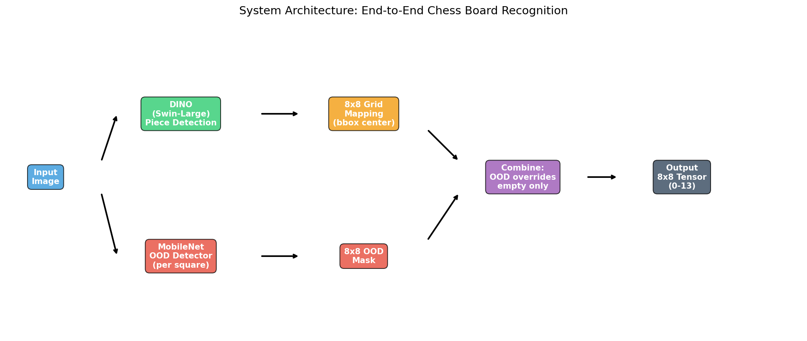
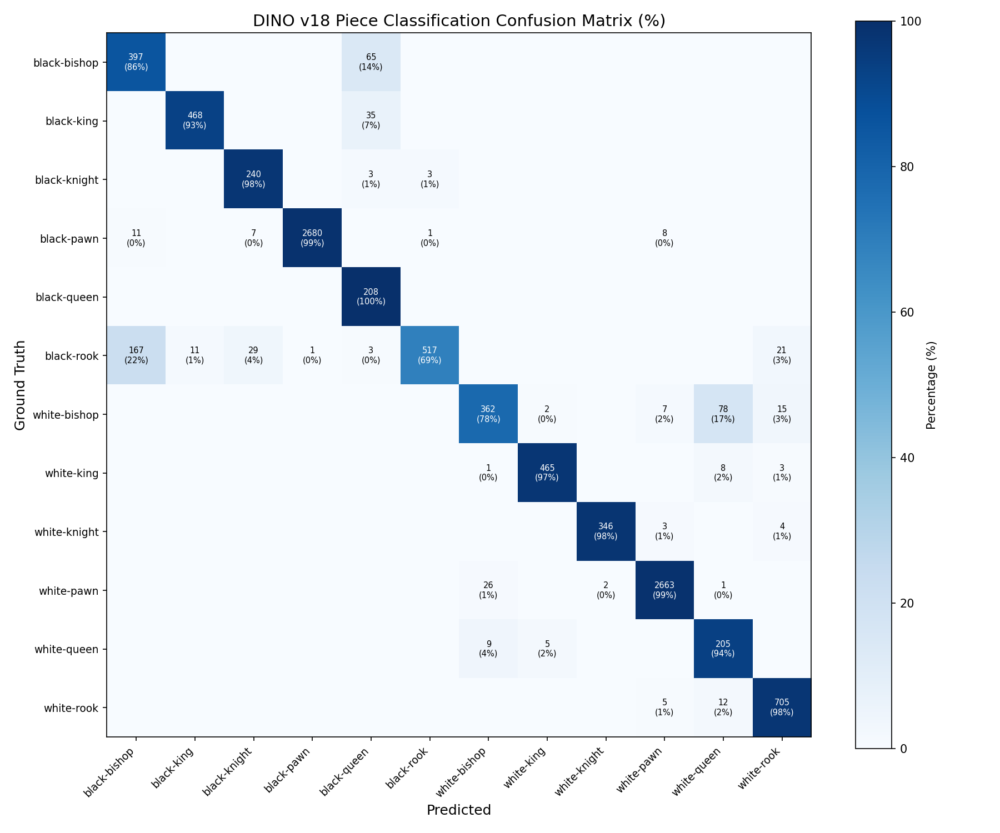
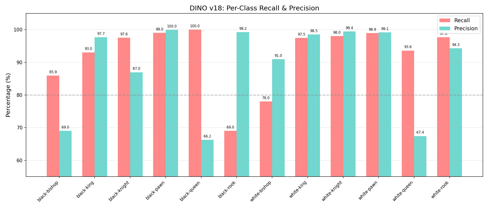
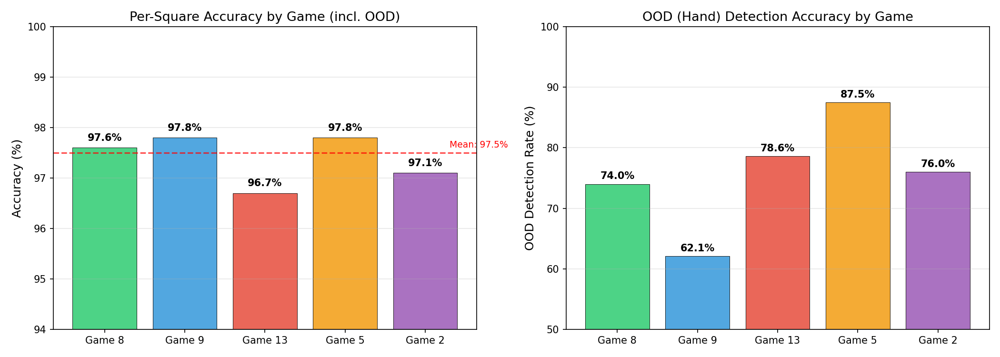
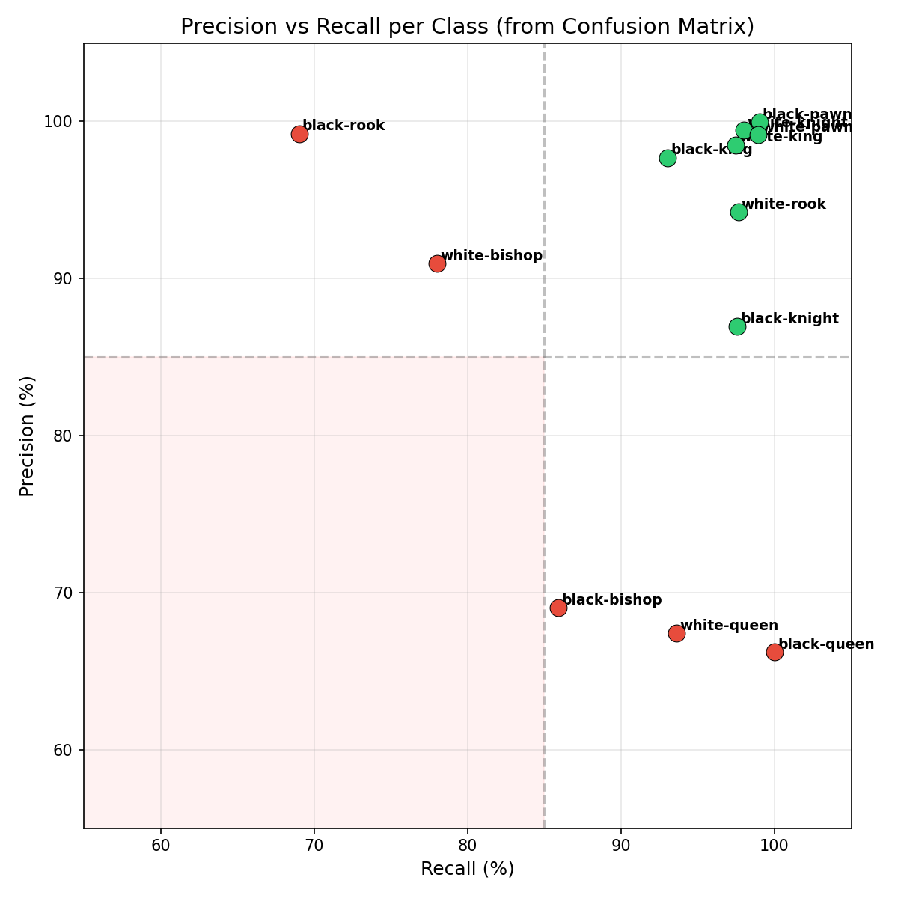
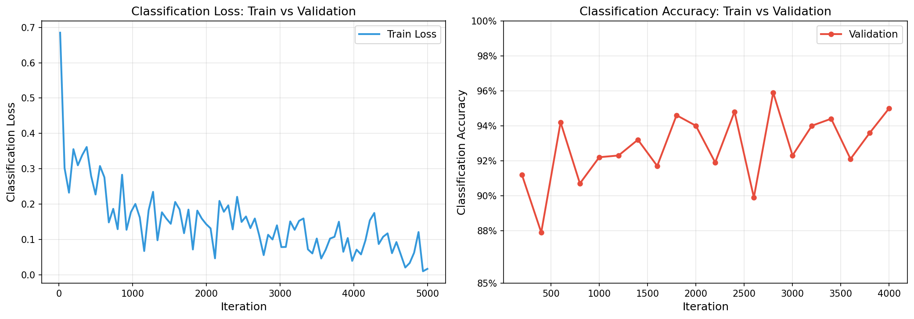
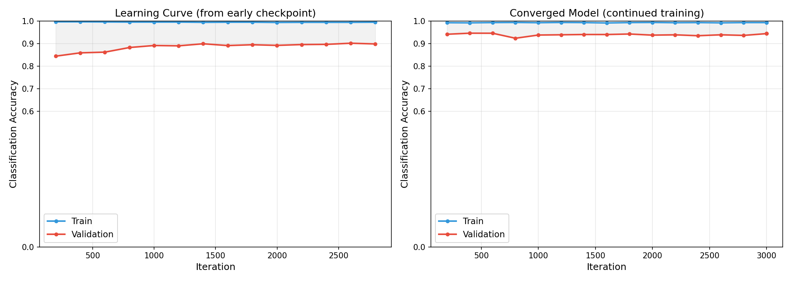
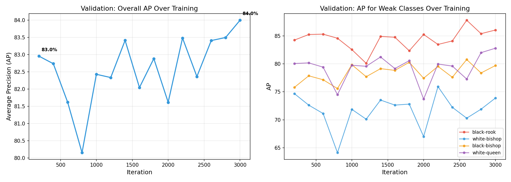

<p align="center">
  <h1 align="center">♟️ Chess Piece Detection with DINO + OOD Detection</h1>
  <p align="center">
    <b>End-to-end chess board recognition from images using DINO object detection and out-of-distribution detection</b>
  </p>
  <p align="center">
    
    
    
    
  </p>
</p>

---

## 📋 Overview

A two-stage system that takes a chessboard image and outputs a complete board state (FEN notation):

1. **DINO Piece Detector** — Swin-Large backbone fine-tuned to detect and classify all 12 chess piece types
2. **OOD Detector** — MobileNetV3-Small binary classifier that identifies occluded/unknown squares (e.g., player's hand)

Built on top of [detrex](https://github.com/IDEA-Research/detrex) (DINO: DETR with Improved DeNoising Anchor Boxes).

<p align="center">
  
</p>

---

## 📊 Results

<table>
<tr>
<td></td>
<td></td>
</tr>
<tr>
<td></td>
<td></td>
</tr>
</table>

### Training Curves

<table>
<tr>
<td></td>
<td></td>
</tr>
<tr>
<td></td>
<td></td>
</tr>
</table>

---

## 🏗️ Project Structure

```
├── projects/dino/                   # DINO training (detrex framework)
│   ├── train_net.py                 #   Training script
│   ├── inference_chess.py           #   Single-image inference with visualization
│   ├── cls_accuracy_hook.py         #   Classification accuracy hook
│   ├── configs/
│   │   └── dino_swin_large_chess_finetune.py
│   └── modeling/
│       ├── dino.py                  #   DINO model
│       ├── weighted_criterion.py    #   Weighted loss for class imbalance
│       └── ood_detector.py          #   Mahalanobis OOD detector
│
├── inference/                       # Inference & evaluation pipeline
│   ├── predict_board.py             #   Full board prediction (DINO + OOD)
│   ├── pieces_detection.py          #   DINO piece detection module
│   ├── ood_detection.py             #   OOD square detection module
│   ├── ood_model.py                 #   MobileNetV3 OOD model definition
│   ├── train_ood.py                 #   OOD model training
│   ├── cfg.py                       #   Configuration constants
│   └── eval_fen_tests.py            #   FEN accuracy evaluation
│
├── data/
│   ├── dino/                        #   DINO piece detection data
│   │   ├── train/train/             #     Training (COCO format)
│   │   └── val/                     #     Validation (COCO format)
│   ├── ood/                         #   OOD training (binary: 0=ID, 2=OOD)
│   └── eval/                        #   End-to-end evaluation
│       ├── game13/                  #     images/ + FEN.txt
│       ├── game2/                   #     images/ + game2.csv
│       └── game5/                   #     images/ + game5.csv
│
├── weights/                         # Model checkpoints
│   ├── dino_swin_large_384_4scale_36ep.pth   # COCO pretrained (for training)
│   ├── dino_chess_model.pth                   # Fine-tuned chess detector
│   └── mobilenet_v3_small_weights.pth         # OOD detector
│
├── scripts/                         # SLURM batch scripts
├── report/                          # Report figures & PDFs
├── detectron2/                      # Detectron2 framework (included)
├── detrex/                          # Detrex framework (included)
├── requirements.txt
└── README.md
```

---

## 🎯 Classes

13 detection classes — 12 piece types + background:

| ID | Class | ID | Class |
|:--:|:------|:--:|:------|
| 1 | ♝ black-bishop | 7 | ♗ white-bishop |
| 2 | ♚ black-king | 8 | ♔ white-king |
| 3 | ♞ black-knight | 9 | ♘ white-knight |
| 4 | ♟ black-pawn | 10 | ♙ white-pawn |
| 5 | ♛ black-queen | 11 | ♕ white-queen |
| 6 | ♜ black-rook | 12 | ♖ white-rook |
| 0 | background | **13** | **OOD (occluded)** |

---

## 🚀 Environment Setup

### 1. Clone the repository

```bash
git clone https://github.com/lidorBrami/chess-Dino.git
cd chess-Dino
git submodule update --init --recursive
```

### 2. Create conda environment

```bash
conda create -n detrex python=3.7 -y
conda activate detrex
```

### 3. Install PyTorch (CUDA 11.3)

```bash
conda install pytorch==1.10.1 torchvision==0.11.2 cudatoolkit=11.3 -c pytorch -c conda-forge
```

### 4. Install dependencies

```bash
pip install -r requirements.txt
```

### 5. Install detectron2 & detrex

Both are included in this repository. Install in development mode:

```bash
cd detectron2
pip install -e .
cd ..

pip install -e .
```

### 6. Download data and weights

The dataset and model weights are not included in this repository due to their size. Download them from our Google Drive:

> **[Download data and weights from Google Drive](https://drive.google.com/YOUR_LINK_HERE)**

After downloading, place them in the repository root:

```bash
mkdir -p weights data
# Place the following files:
# weights/dino_swin_large_384_4scale_36ep.pth  (COCO pretrained, ~800MB)
# weights/dino_chess_model.pth                  (fine-tuned chess detector, ~2.5GB)
# weights/mobilenet_v3_small_weights.pth        (OOD detector, ~5MB)
# data/dino/                                    (training & validation data)
# data/eval/                                    (evaluation data)
```

Alternatively, download only the COCO pretrained weights for training from scratch:

```bash
mkdir -p weights
wget -P weights/ https://github.com/IDEA-Research/detrex-storage/releases/download/v0.2.1/dino_swin_large_384_4scale_36ep.pth
```

---

## 📁 Data Preparation

### DINO training data (COCO format)

```
data/dino/
├── train/
│   └── train/
│       ├── _annotations.coco.json
│       ├── *.jpg
│       ├── game6/
│       │   ├── _annotations.coco.json
│       │   └── *.jpg
│       └── ...
└── val/
    └── game2/
        ├── _annotations_merged.coco.json
        └── *.jpg
```

### OOD training data

```
data/ood/
├── train/
│   ├── 0/   ← in-distribution square crops (*.jpg)
│   └── 2/   ← OOD square crops: hands, occluded (*.jpg)
├── val/
│   ├── 0/
│   └── 2/
└── test/
    ├── 0/
    └── 2/
```

### End-to-end evaluation data

```
data/eval/
├── game13/
│   ├── images/
│   └── FEN.txt
├── game2/
│   ├── images/
│   └── game2.csv
└── game5/
    ├── images/
    └── game5.csv
```

---

## 🏋️ Training

### DINO — Piece Detection

```bash
# Single GPU
python projects/dino/train_net.py \
    --config-file projects/dino/configs/dino_swin_large_chess_finetune.py \
    --num-gpus 1

# Multi-GPU
python projects/dino/train_net.py \
    --config-file projects/dino/configs/dino_swin_large_chess_finetune.py \
    --num-gpus 2
```

<details>
<summary><b>Training hyperparameters</b></summary>

| Parameter | Value |
|-----------|-------|
| Backbone | Swin-Large 384, COCO pretrained |
| Iterations | 5,000 |
| Batch size | 2 |
| Optimizer | AdamW |
| Learning rate | 1e-5 (backbone: 1e-6) |
| Weighted loss | Class weights for imbalance (e.g., black-rook 14x, white-bishop 14x) |
| Eval period | Every 200 iterations |
| Gradient clip | max_norm=0.1 |

</details>

Output: `./output/dino_chess_v25/model_final.pth`

### OOD Detector

```bash
cd inference
python train_ood.py
```

Trains MobileNetV3-Small binary classifier (ID vs OOD) for 30 epochs with balanced sampling.

---

## 🔍 Inference

### Single image — bounding box visualization

```bash
python projects/dino/inference_chess.py \
    --image path/to/chessboard.jpg \
    --output path/to/output.jpg \
    --checkpoint weights/dino_chess_model.pth \
    --threshold 0.3
```

### Full board prediction — DINO + OOD → 8x8 board state

```bash
cd inference
python predict_board.py
```

Pipeline:
1. **OOD detection** — crops each of 64 squares, classifies ID vs OOD
2. **Piece detection** — runs DINO on the full image, assigns detections to grid squares
3. **Merge** — empty squares flagged as OOD get class 13; detected pieces are preserved

---

## 📈 Evaluation

### FEN accuracy evaluation

```bash
cd inference
python eval_fen_tests.py
```

Evaluates board prediction accuracy against ground-truth FEN annotations:

| Game | Format | Description |
|------|--------|-------------|
| game13 | TXT | FEN.txt + image folder |
| game2 | CSV | CSV with frame numbers |
| game5 | CSV | CSV with frame numbers |

**Output:** per-image accuracy, overall accuracy per game, per-class recall & precision.

> **Note:** All inference and evaluation require a CUDA GPU.

---

## 📦 Model Weights

| Model | File | Description |
|:------|:-----|:------------|
| DINO Swin-Large (pretrained) | `weights/dino_swin_large_384_4scale_36ep.pth` | COCO pretrained — download for training |
| DINO Chess (fine-tuned) | `weights/dino_chess_model.pth` | Fine-tuned chess piece detector |
| OOD Detector | `weights/mobilenet_v3_small_weights.pth` | MobileNetV3-Small binary classifier |
